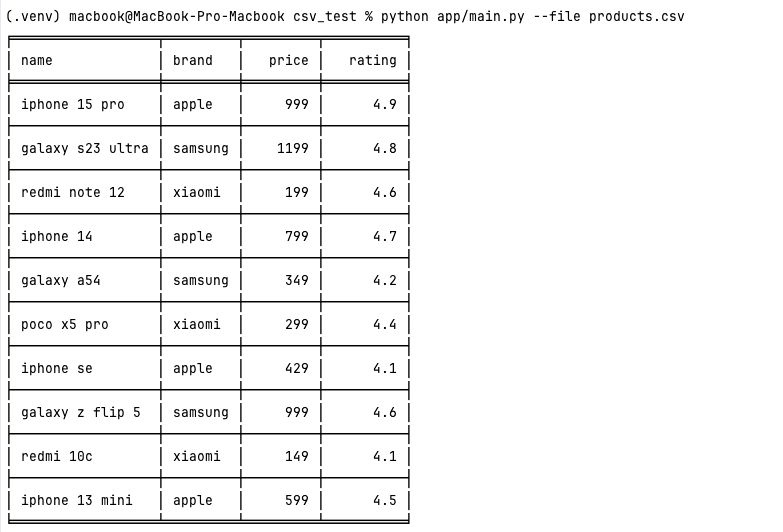
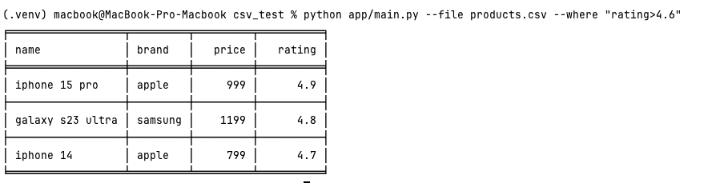
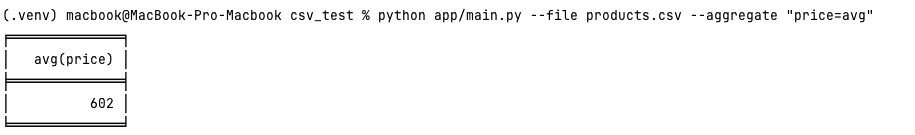
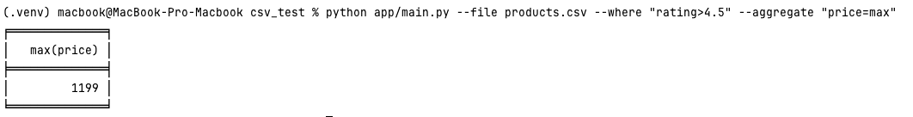
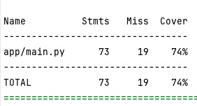

# Обработка CSV файлов.

Скрипт для обработки CSV-файла с поддержкой:

- фильтрации по условиям `>`, `<`, `=`
- агрегации (`avg`, `min`, `max`) по числовой колонке
---
## Структура проекта:

- `app/main.py` — основной файл с запуском и логикой
- `assets/` — скриншоты для `README.md`
- `products.csv` — csv файл
- `requirements.txt` — зависимости   
- `tests/` — тесты для проверки кода  


---

## Установка и настройка проекта

### 1. Клонировать репозиторий

```bash
git clone https://github.com/Beslan26/csv_test.git
cd csv_test
```

---

### 2. Создать и активировать виртуальное окружение

#### На macOS / Linux:

```bash
python3 -m venv .venv
source .venv/bin/activate
```

#### На Windows (PowerShell):

```powershell
python -m venv venv
venv\Scripts\Activate.ps1
```

---

### 3. Установить зависимости

```bash
pip install -r requirements.txt
```

---

### 4. Запуск тестов

Для корректной работы тестов нужно добавить корень проекта в `PYTHONPATH`.

#### На macOS / Linux:

```bash
export PYTHONPATH=$(pwd)
pytest
```

#### На Windows (PowerShell):

```powershell
set PYTHONPATH=%cd%
pytest
```
---

##  Команды запуска и примеры результатов:

### 1. Вывод всех данных из файла:

```bash
python app/main.py --file products.csv
```



---

### 2. Фильтрация:

```bash
python app/main.py --file products.csv --where "rating>4.6"
```



---

### 3. Агрегация:

```bash
python app/main.py --file products.csv --aggregate "price=avg"
```



---

### 4. Фильтрация + агрегация:

```bash
python app/main.py --file products.csv --where "rating>4.5" --aggregate "price=max"
```



---

## % покрытия тестами:

```bash
pytest --cov=app
```



